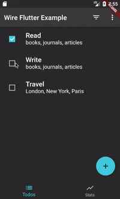

# wire_flutter - WireDataBuilder

WireDataBuilder - data container layer for Flutter from [Wire toolkit](https://pub.dev/packages/wire).

## How to use
This widget subscribes to data changes and rebuild widget when change happened, when `Wire.data('param', value);`
Update on data change:
```dart
WireDataBuilder<int>(
  dataKey: CounterDataKey.COUNT,
  builder: (context, value) => Text(
      '$value',
      style: Theme.of(context).textTheme.headline4,
    )
)
```

You can send messages/signals from UI which can be listened from anywhere else in the app, completely decoupled from the UI::
```dart
FloatingActionButton(
  onPressed: () => Wire.send(CounterSignal.INCREASE),
  child: Icon(Icons.add),
)
```

React on signal and update data (even passing function to data value). The new value or function call result will be propagated to the WireData listener, and build in WireDataBuilder will rebuild widget with already new value.
```dart
Wire.add(this, CounterSignal.INCREASE, (payload, wireId) {
  Wire.data(CounterParams.COUNT, (value) {
    return (value ?? 0) + 1;
  });
});
```

### TodoMVC Examle (based https://github.com/brianegan/flutter_architecture_samples)



Create list from parameter `TodoDataParams.LIST` which is a list of TodoVO ids stored in Wire.data as separate objects
```dart
WireDataBuilder<List<String>>(
    dataKey: TodoDataKeys.LIST,
    builder: (context, list) => ListView.builder(
      key: ArchSampleKeys.todoList,
      itemCount: list.length,
      itemBuilder: (BuildContext context, int index) {
        final todoId = list[index];
    ...
```

TodoItem consume this id (string) and retrieve/subscribe to WireData for changes - this is how updates to TodoVO reflected in UI
```dart
Widget build(BuildContext context) {
    return WireDataBuilder<TodoVO>(
      dataKey: id,
      builder: (context, todoVO) => Visibility(
        visible: todoVO.visible, // render values from TodoVO
        child: ListTile(
            onTap: onTap,
            leading: Checkbox(
              key: ArchSampleKeys.todoItemCheckbox(todoVO.id),
              value: todoVO.completed, // render values from TodoVO
              onChanged: onToggle,
            ),
    ...
```

Any changes "converted" to signals and send to it's listener(s):
```dart
FilterButton(
    isActive: activeTab == AppTab.todos,
    activeFilter: TodoFilterValue.ALL,
    onSelected: (filter) => Wire.send(TodoViewSignal.FILTER, filter),
)
```

View don't know where and who will process these signals, it only cares about rendering data on change.
```dart
    Wire.add(this, TodoViewSignal.INPUT,  _signalProcessor);
    Wire.add(this, TodoViewSignal.EDIT,   _signalProcessor);
    Wire.add(this, TodoViewSignal.DELETE, _signalProcessor);
    Wire.add(this, TodoViewSignal.TOGGLE, _signalProcessor);
    Wire.add(this, TodoViewSignal.FILTER, _signalProcessor);
    Wire.add(this, TodoViewSignal.CLEAR_COMPLETED, _signalProcessor);
    Wire.add(this, TodoViewSignal.COMPLETE_ALL, _signalProcessor);
```

The signals can be processed anywhere, even in multiple places not related to each other - in this example it's one controller - TodoController
You might think about TodoController as reducer from Redux which is listen for "events"-signals and set data. In this example controller is a brain of the application it has business-decision making logic and know how to process data and where to send it for further storage - TodoModel, hence it can store data by itself, but we prefer to decouple responsibility and controller just delegate data to model which knows how and where store data before update it in Wire.data.
```dart
 void _signalProcessor(payload, wireId) {
    final wire = Wire.get(wireId: wireId).single;
    print('> TodoProcessor -> ${wire.signal}: data = ' + data.toString());
    switch (wire.signal) {
      case TodoViewSignal.INPUT:
        var createDTO = payload as CreateDTO;
        var text = createDTO.text;
        var note = createDTO.note;
        var completed = createDTO.completed;
        if (text != null && text.isNotEmpty) {
          todoModel.create(text, note, completed);
          Wire.send(TodoViewSignal.CLEAR_INPUT); // Controller send signal to other parts of the system
        }
        break;
      case TodoViewSignal.EDIT:
        var editTodoDTO = payload as EditDTO;
        var todoText = editTodoDTO.text;
        var todoNote = editTodoDTO.note;
        var todoId = editTodoDTO.id;
        if (todoText.isEmpty) {
          todoModel.remove(todoId);
        } else {
          todoModel.update(todoId, todoText, todoNote);
        }
        break;
 ...
```

View also could subscribe for Wire signals (Wire.add) and update itself on signals from other parts of the system (Controller/Model or other Views), without even knowing who is asking.
See example in Wire repository - [TodoMVC example here](https://github.com/wire-toolkit/wire_dart/tree/master/example/todo)
```dart
class TodoInputView extends DomElement {
  TodoInputView(InputElement dom):super(dom) {
    Wire.add(this, TodoViewSignal.CLEAR_INPUT, (s, d) => dom.value = '');
    dom
      ..text = ''
      ..onKeyPress.listen((e) =>
        e.keyCode == KeyCode.ENTER &&
          Wire.send(TodoViewSignal.INPUT, CreateDTO(dom.value, '')));
  }
}
```
